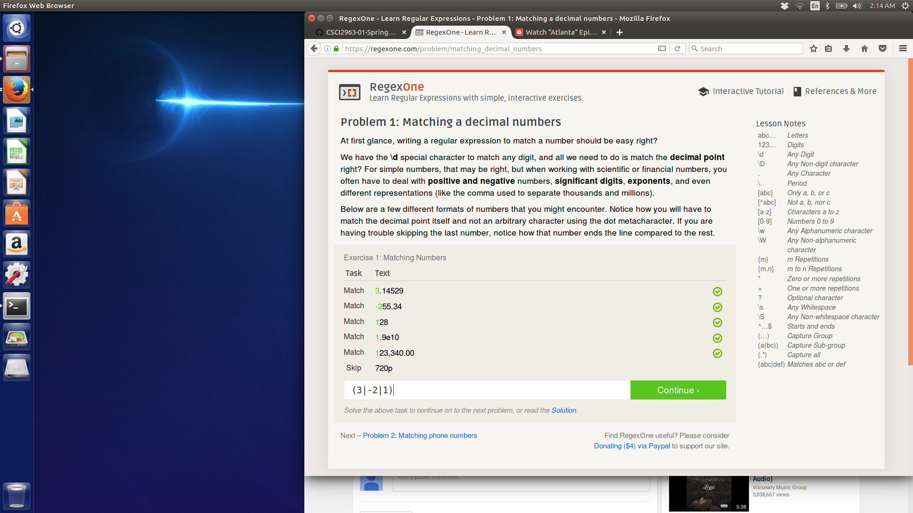
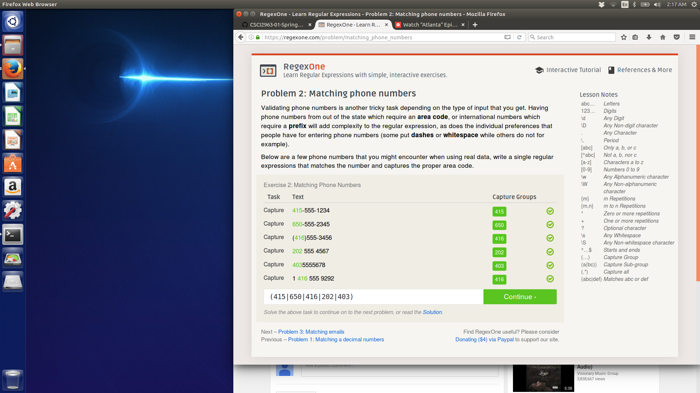
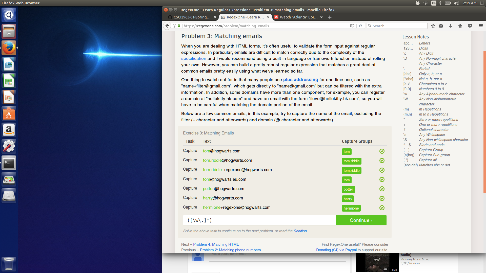
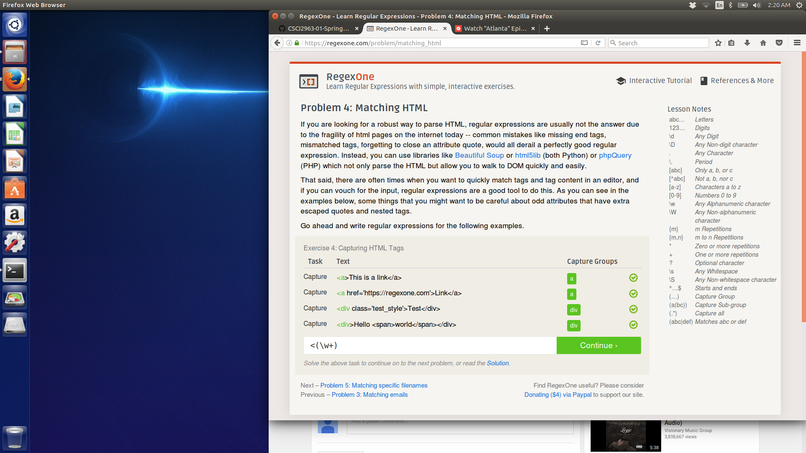
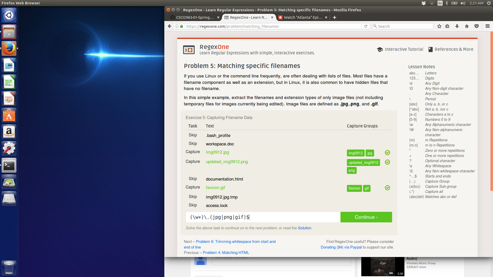
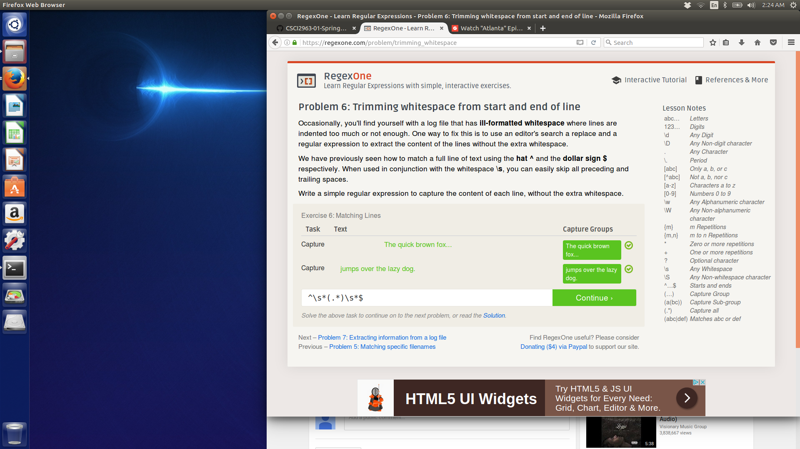
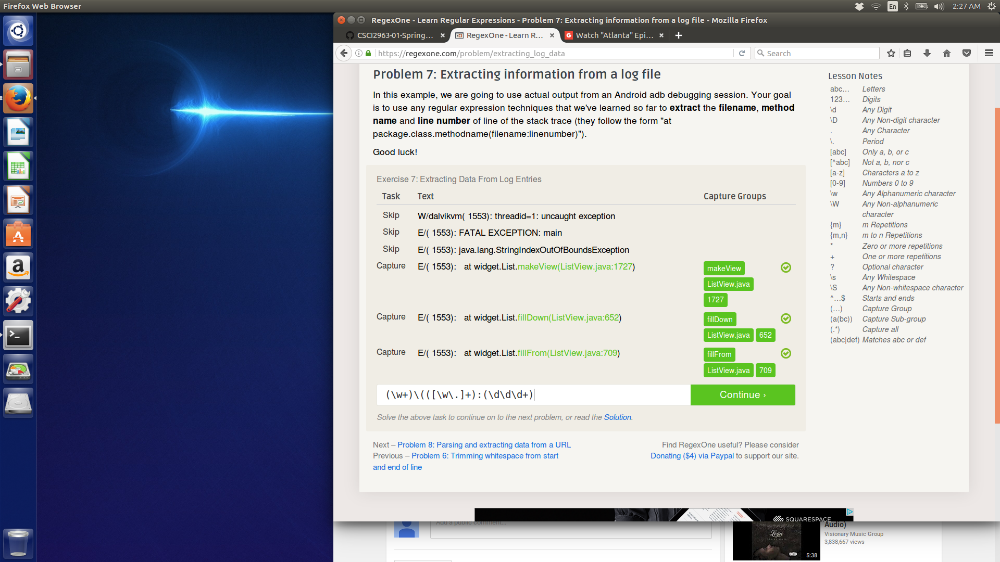

1. Free Distribution - So I guess this just means you can't make money off of Open source software, which makes sense. 
2.Soruce Code - Source code always has to be avaliable, which is also the point. Just gotta make sure there are easy instructions to use it and whatnot. 
3. Derived works - If someone makes your thing better, that should also be free. 
4. Integrity of the Author's Source Code - I suppose this is up to the author. The author may not care otherwise. 
5. Makes sense, but what if you want a racist program? 
6. Can use anything for any purpose. 
7. So anyone who pulls an open source repo gets protected by the same rights it's under? Cool. 
8. Explaining the one above. 
9. Wait, so you can take open source and modify it to make it not open source if the license says so? Or it doesn't, since it shouldn't restrict? Doesn't that violate the stuff above? 
10. makes the project universal. 

Asking a Question the Smart Way:

1. Always thank a person who helps you – that’s just common courtesy. 
2. If it’s for a course, make sure that there are office hours that you can go to if you haven’t already. 
3. I hope this works. 

Free Culture Thing 

Hey cool, it’s mentioning RPI! However, I didn’t know we have a search engine just for us...is it the thing you use to look at other professor’s research? Okay, so he took Microsoft’s tech for it, is that open source? And his improvement was pretty cool, just a button. Oh nooooo he had music on there! Well, it wasn’t his but he got screwed over anyway. See, that’s the problem with America’s legal system. People never look at everything. Shouldn’t the licenses on the technology he was modifiying help him in any way? Oh well. Poor guy, bad situation. 

The never_ending_race_code built in snap should be in the lab1 file. 

I was thinking about making a speech recognition game, that could take voice as input and try to identify what speech you are quoting, then using it to play a game with friends.

I should not have done this lab so late. I will finish labs earlier next time. The RegEx thing was kind of hard to get a handle of. The Snap was interesting because I really don’t like scratch but I am learning Scheme right now. It was cool to see scheme being put to use in a somewhat practical manner. This class seems like it will be interesting. 
