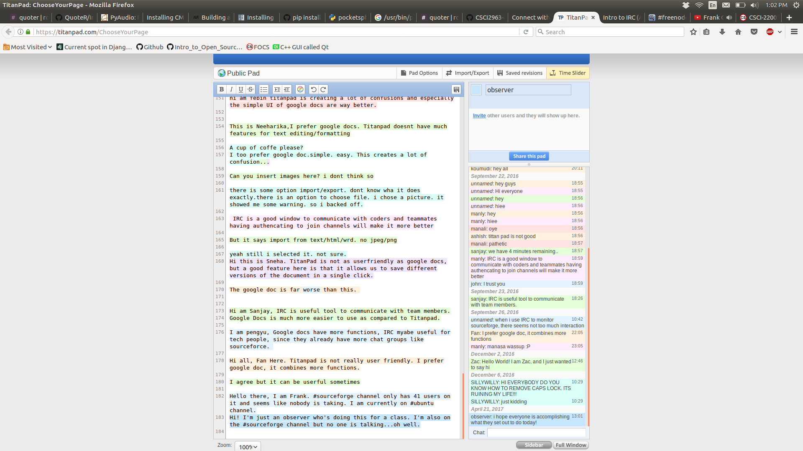

#This is the MD Lab Report file for Lab 11, the optional lab for Intro to Open Source

Part 1: 

So I used ChatZilla to join the #freenode channel on Freenode, and also was on the a11y chat that the instructions told us to do.
I tried asking a question on the #freenode one, I just asked what everyone was working on. I got sarcastic responses, like
"work" and "not getting banned". I can appreciate that but there wasn't any discussion goin on at all. There was no discussion going on
in the #a11y chat, but actually as I write this, some more discussion is happening in the #freenode chat. Mainly people just asking questions
about what the channel was for and if it's safe for IPs to be displayed. Still nothing in the #a11y chat though.

Part 2:

This is me using the titanpad. I was the last lines on both things. I get the point of it and it's cool and all, but google docs is probably better.
It just has more functionality. Can also use Slack for messaging between groups, and c9.io is a good thing to use in order to actually code
with other people together. In order to message a lot of people, Skype or Facebook messenger can be used.

- Synchronous happens one at a time, while aynchronous has a lot of things happening at once.
- Sometimes when communicating with one person, if the other person responds first, you may have to change what you were writing. That is multiplied by number of people in the channel with the group interaction.
- People can be toxic, lie, or not do the work they say they will.
- People are generally pretty good at telling what is a bot. Passing the Turing Test is not easy. 

Part 3:

name: #csci2963-01spring2017
website: rcos.slack.com
Description: it's the slack that our class uses to communicate and for the instructor (Moorthy) to give us information and keep us up to date with the class.
Project Goal: To learn all about Open Source Software!
Communication modes: the slack, and then individual course project slack channels.

Part 4:

- How often should people comment?
- How many comments are too many commments?
- What design patterns are people using and trying to implement?
- If you're just starting on a project, is it ok to make more dependencies needed? Depends on the project?
- what should you give people a hard time about, and what shouldn't you give people a hard time about?
- What can you use to communicate?
- What do you do when something isn't working how you want it to, and people are mad at you for it?
- What are some habits you can do that would have people appreciate your code style?
- How can you make errors obvious? Name some examples.
- Tabs or spaces?

This is a response to the coding standards vs. coding styles article.
Okay, so I thought they were one and the same, but they are not.
Coding styles are dependant on the person, for example, the classic Holy War that is tabs vs. spaces. However, coding standards are things like how variables should be treated and used. Coding styles probably are very integral with design patterns, and can encomass code style. However, some of these coding-standard things are common sense. For example, of course a bool function should return a boolean. Some languages won't even compile if there's a type mismatch like that. The negative buffer thing is good though, which says they are bad. There's just a bunch of good programming practices there that one can follow, and should if they're working on an open source project.

Now, when it comes to the coding-style parts of it, that shouldn't be too much of an issue. It's not like they increase file size monumentaly. However, if someone overwrites the + operator to do a - operation, that is a problem. But when it comes to open source projects, that's why we have things like code reviews and reviews of PR requests. There are also good tips on designing coding standards in the article. I feel that if the standard is well defined, it shouldn't be a problem to follow it, and will make it more readible in the long run. Writing good code is rewarding after all! 